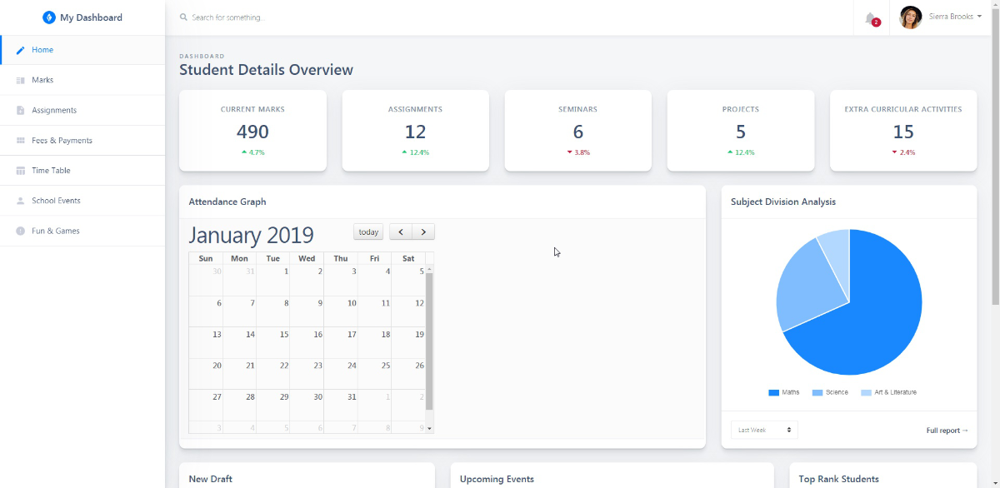
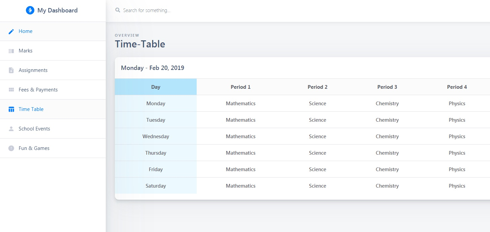

# School Manager Web App Demo using Spring MVC (maven)

A simple demo app *work in progress* (contributors are welcome), to learn about the various working of a school management app.

## Time Table Preview

## MySql Database Backup (exported from mysql workbench 8.0)
 - [Drive File](https://drive.google.com/file/d/1IGbOklJtrxHGP0CJ8A1LD6r5FnjALZ1A/view?usp=sharing)

## Frameworks/libs Used
- Spring MVC (4.1)
- Hibernate 4
- MySql (v8.0)

## Tools Used
 - Netbeans 8.2 (IDE)
 - Mysql workbench 8.0

## Theme used : [Awesome Shards Dashboard Lite](https://designrevision.com/downloads/shards-dashboard-lite/)

## Javascript Libraries used
 - JQuery
 - [FullCalendar](https://fullcalendar.io/)
 - [Chart js](https://www.chartjs.org/)
